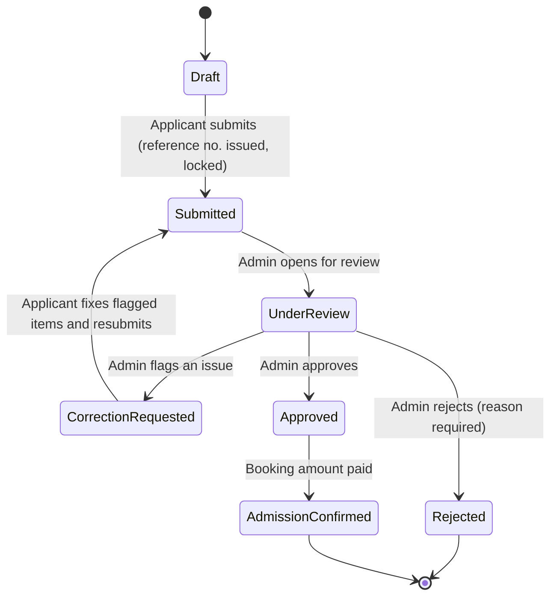
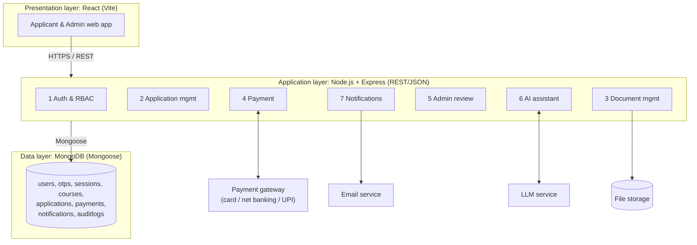
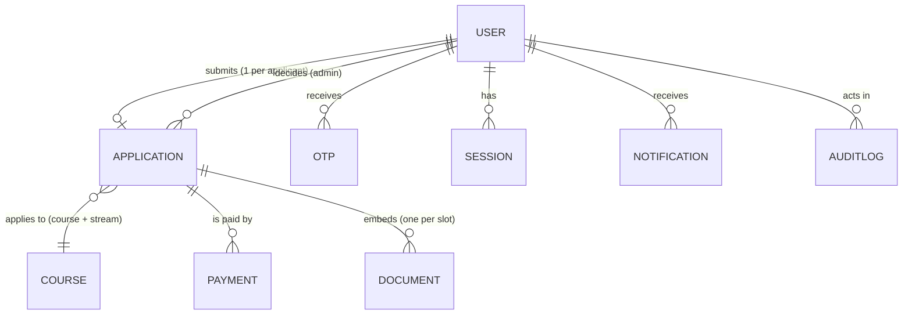

# UEM Admission Management System: Product Document

> **Institute of Engineering & Management, Kolkata (IEM–UEM Group)**
> Software Engineering Lab project, Team 7 "Adminatrix"
> Stack: **MERN** (MongoDB, Express, React, Node.js)

**How to read this document.** Every feature is tagged with its SRS requirement ID (e.g. `FR11`). Anything that is a *decision we made that the SRS does not state* is marked **[ASSUMPTION]**. Anything that *changes* the current SRS is marked **[CHANGE]**. **Nothing is implemented yet:** this document is the design baseline for a fresh start. Section 15 lists what is still open.

---

## 1. What the product is

The UEM Admission Management System is a web portal that takes a prospective student from **creating an account** to **a confirmed seat**, and gives the admission office a single place to **review, verify, decide and report** on applications.

It replaces a process that today is split across a public information page (`iem.edu.in/admissions`), an external ERP form (`iemcrp.com`), offline paperwork and manual payment checking, with one portal that has a clear status at every step.

### The problem it solves

| Today (from the official admissions page) | Pain | What this product does |
|---|---|---|
| Information is on one site, the form on another, payment instructions in a table | Applicants don't know where they are in the process | One portal, a guided multi-section form, a live status tracker |
| Documents are verified, then fees paid, then paperwork submitted offline | Staff chase applicants by phone; no visibility | Upload once, verify online, flag specific documents with comments |
| Payments come by NEFT, DD, net banking, cards, GPay/PhonePe | Staff must match bank entries to applicants by hand | Online gateway for instant confirmation; admin-recorded UTR/DD for offline payments |
| Eligibility differs per course (10th/12th/PCM/graduation %) and is only a table | Ineligible applicants apply; officers re-check manually | Eligibility rules stored per course; AI course recommender; officer sees the numbers beside the rules |
| Anti-ragging undertaking is a separate multi-step external process | Easy to forget; missing at the last minute | A mandatory document slot with the reference number captured |

### Goals
1. Let an applicant finish an application without visiting the campus until final document submission.
2. Give the admin team a verified, searchable, auditable record of every application.
3. Make payment confirmation trustworthy (never rely on the browser alone).
4. Use AI only as **advisory help** (answering questions, pre-checking documents). It must never block or decide anything.

### Non-goals (out of scope for this version)
- Running the entrance exams or counselling (IEMJEE / IEMCET / CAT / MAT happen elsewhere; we record the result).
- Scheduling and scoring MBA Aptitude and GD/PI rounds **[ASSUMPTION]**.
- Integrating with the external anti-ragging site (we capture the reference number and the signed PDF only).
- Post-admission student ERP, timetables, LMS.

---

## 2. Users and roles

| Role | Who | Can do | Cannot do |
|---|---|---|---|
| **Applicant** | Prospective UG/PG student (or parent filling on their behalf) | Register, verify, fill/save/edit the form, upload documents, submit, pay, track status, read notifications, use the AI assistant | See anyone else's application; touch an application after submission (unless a correction is requested) |
| **Admin** | Admission officer | Search/filter applications, open the consolidated view, verify/flag documents, request corrections, approve/reject (reason required for reject), record offline payments, view dashboard and exports | Self-register (admins are created by a seed script only); change applicant-entered data |
| **AI Assistant** | A feature, not a login role | Answer questions, recommend courses, pre-check documents, explain status, summarise trends for admin | Change data, decide outcomes, or block submission |

Access control is **deny by default**: every protected route checks the session and then the role.

---

## 3. How the real IEM admission works (the process we digitise)

Source: `https://iem.edu.in/admissions/` (page last modified 31 Aug 2026). **Fees and criteria change every year, so the system stores them per academic year and never hard-codes them.**

### The official steps
1. **Documents verification** (for newly allotted students)
2. **Payment** (for those who will take admission)
3. **Documents submission with the offline admission form** (after which the student can get the PI report)

### Programmes, eligibility and fees (as published)

| Programme | Entrance | Minimum % | Semester fees |
|---|---|---|---|
| B.Tech CSE (4 yrs) | IEMJEE counselling | 10th 80, 12th 80 | ₹1,40,000 (sem 1), ₹1,15,000 (sem 2–8); total ₹9,45,000 |
| B.Tech CSE (AI) | IEMJEE | 10th 70, 12th 70, PCM 50 | same as above |
| B.Tech CSE (AI & ML) | IEMJEE | 10th 75, 12th 75, PCM 50 | same as above |
| B.Tech CSE (DS), AI & DS, IoT, IoT CS BCT, Cyber Security, Biotech | IEMJEE | 10th 60, 12th 60, PCM 45 | same as above |
| B.Tech IT | IEMJEE | 10th 70, 12th 70, PCM 50 | same as above |
| B.Tech ECE / Electrical / Mechanical | IEMJEE | 10th 60, 12th 60, PCM 45 | same as above |
| BHM (4 yrs) | IEMCET | 10th 60, 12th 60 | ₹60,000 (sem 1), ₹50,000 (sem 2–8); total ₹4,10,000 |
| BBA & BCA (4 yrs) | IEMCET | 10th 60, 12th 60 (2-year gap allowed; BCA needs Maths/Business Maths/Computer subject in 12th) | ₹70,000 (sem 1), ₹60,000 (sem 2–8); total ₹4,90,000 |
| BBA LLB (5 yrs) | IEMCET | 10th 60, 12th 60 | ₹60,000 (sem 1), ₹50,000 (sem 2–10); total ₹5,10,000 |
| MCA (2 yrs) | IEMCET | 10th 60, 12th 60, graduation 60 | ₹75,000 × 4; total ₹3,00,000 |
| MBA / MBA (GM) | CAT / MAT (+ Aptitude, GD/PI) | 10th 55, 12th 55, graduation 55 | ₹1,75,000 × 4; total ₹7,00,000 |
| M.Tech CSE / CSE (AIML) / ECE | IEMCET | 10th 60, 12th 60, graduation 60 | ₹77,000 (sem 1), ₹75,000 (sem 2–4); total ₹3,02,000 |

**Booking amounts** are published for some programmes only: ₹50,000 for class-12-appearing students and ₹1,40,000 for pass-outs (some B.Tech streams, BBA/BCA ₹50,000), ₹1,62,000 (MBA), ₹77,000 (M.Tech). Six B.Tech rows state none, so the system stores `null` there rather than guessing.

### Other published charges and rules
- **Uniform ₹6,500** and **medical fitness report ₹1,000** for all candidates.
- **Payment modes:** NEFT, DD (in favour of *Institute of Engineering & Management Trust*), net banking, credit/debit card, Google Pay, PhonePe.
- **Anti-ragging undertaking:** student registers at the national anti-ragging site, receives a **reference number**, downloads the undertaking PDF, prints and signs it.
- Admission offices exist only at the IEM Ashram Building (Salt Lake), the UEM Building (New Town) and UEM Jaipur. The portal should state this to help avoid fraud.

### 3.1 The existing admission form (reference for our form)

Source: screenshots of the live form, "Admission Form for the Session 2026-27", IEM New Town (a constituent institute under UEM Kolkata). `*` = compulsory on the existing form.
**Limits:** the screenshots show the top of the form down to "Post Graduate" and then the bottom ("Communication" to "Submit"). Anything between them and every dropdown's option list were **not seen**; they are listed in §15.

| Section | Fields on the existing form |
|---|---|
| **Course** | Course\* (e.g. B.Tech), Stream\* (e.g. BioTech) |
| **Candidate** | Full name\* ("in full; initials and titles such as Mr, Ms not allowed"), Gender\*, Date of birth\* (DD/MM/YYYY), student email, student mobile\* |
| **Address** | Present address\* (first two lines compulsory; PO, Dist, PIN, State), Permanent address\* with a "Same as present" tick |
| **Family** | Father: name\*, email, mobile · Mother: name\*, email, mobile · Guardian: name\*, relation, full office address and designation\*, office phone, monthly income (Rs)\*, guardian mobile |
| **Citizenship** | Foreign student?\* (Yes/No); residence; passport no., date of issue; visa no., date and place of issue |
| **Admission test** | Test name\* (dropdown), year of exam\*, registration no.\*, rank\* ("enter 0 if result not declared") |
| **10th standard** | Exam name\*, board/council\*, year of passing\*, % of marks in aggregate\*, school name\*, subjects\* |
| **12th standard** | Exam name\*, board/council\* (dropdown), year\*, % aggregate\* ("0 if not declared"), school name\*, school address\* (dropdown) |
| **12th subject marks** | English\*, Physics\*, Chemistry / Computer Science\*, Mathematics\* (*not applicable for BBA / MBA*; "0 if not declared") |
| **Degree** | Degree name\*, board/council\*, year\*, % aggregate\*, institution\*, subjects\* |
| **Post graduate** | Degree name, board/council, year, %, institution, subjects (optional) |
| **Other details** | Category (default General; "except General must produce certificate"), blood group, religion, activities / hobbies (max 250 characters), candidate's Aadhaar no., guardian's PAN, **ABC ID\*** |
| **Communication** | Email address (a link to print the form is sent there), guardian mobile |

**Observation:** the existing form is *data capture only*. It has no document upload, payment, status tracking or drafts; documents are handed in offline later. Our product deliberately extends it (§1, §4).

---

## 4. End-to-end journeys

### 4.1 Applicant journey

```
Register → Verify OTP → Log in → Fill form (draft any time) → Upload documents
   → Preview → Submit (locks, reference number issued) → [Admin review]
   → Approved → Pay booking amount (+ fixed charges) → Admission Confirmed
```

1. **Register** (`FR2`): name, email, country code + 10-digit mobile, password, consent. Account is *unverified* until the OTP sent by email is entered (10-minute expiry, resend allowed).
2. **Log in** (`FR3`): by email or mobile + password. Five consecutive failures lock the account temporarily.
3. **Fill the form** (`FR4`), modelled on the existing IEM form (§3.1), in steps: Course & personal → Address → Family → Citizenship (only if "foreign student" is Yes) → Admission test & academics → Other details → Documents → Review & Submit. Sections that don't apply to the chosen course are hidden (§6). Fields validate as the user types; incomplete sections cannot be passed.
4. **Save draft / resume** (`FR7`) and **edit any section** before submitting (`FR8`).
5. **Upload documents** (`FR9`) into labelled slots. PDF/JPG/PNG, max 5 MB each, immediate format/size check with a specific reason on failure, progress bar, confirmation per file. An optional AI quality check may suggest re-uploading a blurry scan (`FR22`).
6. **Preview** (`FR10`): read-only summary in form order with "jump back" links.
7. **Submit** (`FR11`): enabled only when mandatory fields and documents pass. On submit the system assigns a **unique reference number**, locks the application, timestamps it, sets status **Submitted**.
8. **Track status** (`FR12`) on the dashboard; the status updates without re-login. **Notifications** (`FR13`) arrive in-app and by email.
9. **After approval:** pay the admission/booking amount online (or by NEFT/DD, which an admin records); a **receipt PDF** (`FR16`) becomes available; status becomes **Admission Confirmed**.
10. **Forgot password** (`FR14`): email OTP valid for 15 minutes.

### 4.2 Admin journey
1. Log in with an admin account (created by seed script).
2. **Search/filter** the application list by course, status, submission date range, payment status, with pagination (`FR17`).
3. **Open the consolidated view** (`FR6`): all personal, academic and preference data beside the uploaded documents.
4. **Verify or flag each document** with an optional comment (`FR6.2`). **Request a correction** if something is wrong.
5. **Approve or reject** (`FR18`). A reason is mandatory for rejection. The system records who decided and when, and notifies the applicant.
6. **Record offline payments** (NEFT/DD reference) so they reconcile with the applicant's record.
7. **Dashboard and reports** (`FR19`): totals, by status, by course, payment completion rate; export CSV/PDF for a date range. AI trend insights appear in a separate panel (`FR24`).

### 4.3 Application status lifecycle



- The SRS lists five applicant-visible statuses (Submitted, Under Review, Correction Requested, Approved, Rejected). **[ASSUMPTION]** We add `Draft` (before submission) and `Admission Confirmed` (after booking payment) because the official process has a payment step after verification.
- **Correction flow [ASSUMPTION]:** the SRS locks an application on submit (`FR11`) but also defines *Correction Requested* (`FR12`) without saying how editing is re-enabled. Our design: only the flagged sections unlock; everything else stays locked; resubmitting returns the application to *Submitted*.

---

## 5. Features by module

The system has seven modules (from the High-Level Design). Priority: **H**igh / **M**edium / **L**ow, from the SRS.

### Module 1: Authentication & access (Member A)
| Feature | SRS | Notes |
|---|---|---|
| Registration with validation and consent | FR2 | Password: 8+ chars, upper-case, number, special character |
| OTP email verification and resend | FR2 | Codes stored only as hashes; 10-min expiry; attempt limit |
| Login, lockout, generic error messages | FR3 | Wrong email and wrong password give the *same* message |
| Logout ends the session immediately | FR3 | Server-side sessions, so deletion is instant |
| Password recovery | FR14 (M) | 15-minute OTP; resets revoke all sessions |
| Role-based access control | NFR 4.2.4 | applicant / admin |

### Module 2: Application management (Member B)
| Feature | SRS | Pri |
|---|---|---|
| Multi-section application form with inline validation | FR4 | M |
| Course and stream selection (one course, one stream) **[CHANGE]** | FR4.4 | M |
| Conditional sections by course level and citizenship **[ASSUMPTION]** | FR4 | M |
| Draft save with timestamp, auto-resume | FR7 | M |
| Edit before submission | FR8 | M |
| Read-only preview | FR10 | M |
| Submit and lock, reference number | FR11 | H |
| Status tracking with last-change date | FR12 | H |

### Module 3: Document management (Member B)
| Feature | SRS | Pri |
|---|---|---|
| Labelled upload slots, 5 MB, PDF/JPG/PNG, progress and confirmation | FR9 | H |
| Instant format/size validation with specific reasons | FR6.3, 6.4 | H |
| Admin verify/flag with comment | FR6.2 | H |

**Document slots [ASSUMPTION]:** `marksheet10`, `marksheet12`, `graduationMarksheet` (PG only), `idProof`, `photograph`, `antiRaggingUndertaking`, and `categoryCertificate` (required when the category is not General, as the existing form states). The SRS says only "mark sheets, ID proof, photograph"; we split marksheets by level and add the anti-ragging undertaking because the official process requires it.

### Module 4: Payment (Member C)
| Feature | SRS | Pri |
|---|---|---|
| Fee display per selected course | FR5.1 | H |
| Hosted gateway checkout (card, net banking, UPI) | FR5.2, IR-5.2 | H |
| Server-side payment status verification and re-check of pending payments | FR15 | H |
| Receipt with transaction ID, amount, date/time, applicant, PDF download | FR16 | M |
| Offline payments (NEFT/DD) recorded by an admin | from official page | n/a |

### Module 5: Admin review (Member A)
| Feature | SRS | Pri |
|---|---|---|
| Consolidated application view | FR6.1 | H |
| Search, filter, paginate | FR17 | H |
| Approve / reject with mandatory reason, deciding admin logged | FR18 | H |
| Dashboard, charts, CSV/PDF export | FR19 | M |

### Module 6: AI assistant (Member C)
All AI output is **labelled as AI-generated, advisory only, and fails safe**: if the AI service is down or slow, the core admission flow continues unaffected (IR-5.6.2, NFR-8).

| Feature | SRS | Pri |
|---|---|---|
| Admission chatbox with session memory, available on every applicant page | FR20 | M |
| Course recommender: up to 3 programmes with justification; never changes the applicant's preferences | FR21 | L |
| Document quality pre-check (blur, lighting, cropped, missing pages); advisory only, never blocks submission | FR22 | M |
| Status explainer in plain language, with the next step | FR23 | L |
| Admin trend and anomaly insights (in-demand courses, reasons for incomplete applications, rejection spikes) | FR24 | L |

### Module 7: Notifications (Member C)
| Feature | SRS | Pri |
|---|---|---|
| In-app and email notification on status change, payment confirmed, correction requested, deadline within 3 days; each with a deep link | FR13 | M |

---

## 6. Business rules

1. **One application per applicant** **[ASSUMPTION]**.
2. **Name** ≤ 100 characters (`FR4.2`). **Mobile** = country code + exactly 10 digits. **Gender** M/F. **Marks/percentages** 0–100 (`FR4.6`).
3. **One course and one stream per application** **[CHANGE]**. The existing form takes one; the SRS currently allows 3 ranked preferences (`FR4.4`).
4. **Submit is enabled only if** every mandatory field is complete and every mandatory document has passed validation (`FR11`).
5. **After submit** the applicant cannot edit, except flagged sections during *Correction Requested*.
6. **Rejection always has a reason**; every decision records the deciding admin and timestamp (`FR18`).
7. **Eligibility** (10th/12th/PCM/graduation minimums) is stored per course and shown to the officer next to the applicant's marks. **[ASSUMPTION]** It is advisory for the officer, not an automatic rejection.
8. **Booking amount** depends on class-12 status (*Appearing* vs *Passed*) where the course publishes one.
9. **Payment amounts are computed on the server** from course data. The browser never sends an amount we trust.
10. **A payment is only "Success" after the server confirms it** with the gateway (webhook plus a status-API check). A browser redirect alone is never enough (`FR15`).
11. **Application fee [ASSUMPTION]:** the official page shows none, so `applicationFee` defaults to ₹0 and, when 0, the payment gate before submission is skipped. If the admissions office confirms a fee, it is configured per course and `FR5.3` applies (waivers supported).
12. **Payment timing [ASSUMPTION]:** the booking/admission payment happens **after** admin approval, matching the official order (verify, then pay).
13. **Names are entered in full**, with no initials or titles (Mr, Ms…), as the existing form requires. Same rule for father, mother and guardian names.
14. **Mandatory fields follow the existing form's asterisks** (§3.1). The existing "enter 0 if result not declared" convention is replaced by an empty value plus `class12Status = Appearing` **[ASSUMPTION]**, because a stored 0 would look like a real mark.
15. **Conditional sections [ASSUMPTION]:** citizenship details only when "foreign student" = Yes; 12th subject marks hidden for BBA and MBA; degree block shown for PG programmes; post-graduate block always optional.
16. **Address:** present address required; permanent address required unless "same as present" is ticked.
17. **Category:** a category other than General requires an uploaded certificate (`categoryCertificate` slot).
18. **ABC ID is mandatory.**
19. **Sensitive data** (Aadhaar, PAN, family income, passport and visa, religion, blood group) is collected only because the existing form collects it, and is handled as set out in §10.

---

## 7. Architecture



### Layers and responsibilities
| Layer | Responsibility | Must not |
|---|---|---|
| **React client** | Screens, form state, client-side validation for fast feedback | Be trusted for any rule; hold secrets |
| **Routes** (Express) | HTTP in/out, authentication, role check, input validation | Contain business rules |
| **Services** | Business rules (submit checks, status transitions, fee calculation) | Know about HTTP |
| **Models** (Mongoose) | Data shape, schema-level validation, indexes | Contain workflow logic |
| **Integrations** | Payment gateway, email, LLM, file storage behind small interfaces | Leak provider details into services |

**Why this separation:** the same business rule (e.g. "can this application be submitted?") is needed by the submit route, the preview screen and tests. Putting it in one service keeps behaviour consistent.

### Technology choices
| Concern | Choice | Reason |
|---|---|---|
| Frontend | React + Vite, React Router, Axios | Component model suits a multi-step form; fast dev server |
| Backend | Node.js + Express | One language across the stack; small and easy for a 3-person team |
| Database | MongoDB + Mongoose | Application data is a nested document (sections, documents, preferences) read and written together |
| Auth | Server-side sessions in an `httpOnly`, `SameSite=Strict` cookie | Logout must end the session immediately (`FR3`); JS cannot read the cookie (XSS safety) |
| Validation | Zod (request) + Mongoose (storage) | Two independent lines of defence |
| Passwords | bcrypt (salted) | NFR 4.2.3 |
| Tests | Node's built-in test runner + Supertest | No extra framework to learn |
| Dev proxy | Vite proxies `/api` to Express | Browser sees one origin, simpler cookies |

### Project structure (proposed; not yet created)
```
iem-admission/
├─ README.md
├─ client/                 React (Vite)
│  ├─ vite.config.js       proxies /api → :5000
│  └─ src/  api/http.js    shared axios instance (cookie + normalised errors)
└─ server/                 Express API
   ├─ .env.example
   ├─ src/
   │  ├─ app.js            security headers, CORS, JSON, cookies, routes, error handler
   │  ├─ index.js          connects MongoDB, starts server
   │  ├─ config.js · errors.js
   │  ├─ middleware/errorHandler.js
   │  └─ models/           User · Otp · Session · AuditLog · Course · Application · Payment · Notification
   └─ tests/               health.test.js · models.test.js
```
Planned per-module folders: `server/src/modules/<name>/{routes,service}.js` and `client/src/features/<name>/`.

---

## 8. Data model

### Entities and ownership
| Collection | Owner | Purpose | Key points |
|---|---|---|---|
| **User** | A | Account and credentials | `passwordHash` hidden by default; unique email and full phone; `role` defaults to `applicant`; lockout counters; consent flag |
| **Otp** | A | Verification and reset codes | Only a hash is stored; expiry via MongoDB TTL index; attempt counter |
| **Session** | A | Logged-in sessions | Only a hash of the cookie token; TTL expiry; deleting the row = instant logout |
| **AuditLog** | A | Who did what, when | Actor, action, target, detail (NFR 4.2.5) |
| **Course** | B | Programme catalogue | Level, duration, entrance type, eligibility %, semester fees, booking amount, optional application fee, academic year |
| **Application** | B | One per applicant | Embedded course and stream, personal, address, family, citizenship, admission test, academics (10th, 12th, degree, post graduate), other details, documents, decision; status, timestamps, reference number |
| **Payment** | C | Fee transactions | Kind (application/admission), line items, method (online/NEFT/DD), gateway reference, offline reference, status, receipt number |
| **Notification** | C | In-app inbox | Type, message, deep link, read flag |

### Relationships


### Application document: target fields

Derived from the existing form (§3.1). `R` = required. Required rules marked "if" are conditional (§6).

| Group | Fields | R |
|---|---|---|
| Course | course (reference), stream | R |
| Candidate | fullName (in full), gender, dob | R |
| | email, mobile (country code + 10 digits) | mobile R |
| Address | present: line1, line2, PO, district, PIN, state | R |
| | permanent: same fields, or `sameAsPresent` | R unless same |
| Family | father: name, email, mobile | name R |
| | mother: name, email, mobile | name R |
| | guardian: name, relation, office address and designation, office phone, monthly income, mobile | name, office address, income R |
| Citizenship | isForeign; if foreign: residence, passportNo, passportIssueDate, visaNo, visaIssueDate, visaIssuePlace | isForeign R |
| Admission test | test name, year, registrationNo, rank | R |
| 10th | examName, board, yearOfPassing, percent, school, subjects | R |
| 12th | examName, board, yearOfPassing, percent, school, schoolAddress, class12Status | R |
| 12th subject marks | english, physics, chemistryOrCS, maths (not for BBA/MBA) | R if applicable |
| Degree | name, board, year, percent, institution, subjects | R if PG |
| Post graduate | name, board, year, percent, institution, subjects | optional |
| Other | category, bloodGroup, religion, activities (≤ 250 chars), aadhaarNo (encrypted), guardianPan (encrypted), abcId | abcId R |
| Anti-ragging | referenceNo | R before submission |
| Workflow | status, referenceNo, draftSavedAt, submittedAt, statusChangedAt, decision{by, at, reason} | system |

### Embed vs reference (a design decision to defend)
- **Embedded in Application:** course and stream, personal, address, family, citizenship, academics, other details, documents, decision. They are always loaded together (preview, admin view), are bounded in size (one course, a fixed set of document slots) and never queried on their own.
- **Separate collections:** Payment (queried by status, re-checked by a background job, needs its own audit trail), Notification (an inbox listing), Session/Otp (TTL cleanup), Course (shared across many applications).

### Rules enforced in the schema itself
Percentages 0–100 · name ≤ 100 · mobile exactly 10 digits · gender M/F · status in the allowed set · exactly one course and stream · documents limited to PDF/JPG/PNG, ≤ 5 MB, one per slot · payment `amount` must equal the sum of its items · offline payments require a UTR/DD reference · non-negative money.

**Status:** design only. No models are written yet. Unique and TTL indexes will need testing against a real MongoDB.

---

## 9. API surface (proposed; not yet built)

All routes are under `/api`, JSON only, errors shaped as `{ error: { code, message, details } }`.

| Module | Endpoint | Who | SRS |
|---|---|---|---|
| Auth | `POST /auth/register`, `/verify-otp`, `/resend-otp` | public | FR2 |
| | `POST /auth/login`, `/logout` · `GET /auth/me` | public / any | FR3 |
| | `POST /auth/forgot-password`, `/reset-password` | public | FR14 |
| Courses | `GET /courses` | any | FR4.4, FR5.1 |
| Application | `GET/PUT /applications/me` (draft save) | applicant | FR4, 7, 8 |
| | `GET /applications/me/preview` · `POST /applications/me/submit` | applicant | FR10, 11 |
| Documents | `POST /applications/me/documents/:slot` · `DELETE …/:slot` | applicant | FR9 |
| Payment | `POST /payments` (create order) · `POST /payments/webhook` · `GET /payments/:id/status` · `GET /payments/:id/receipt` | applicant / gateway | FR5, 15, 16 |
| Notifications | `GET /notifications` · `PATCH /notifications/:id/read` | applicant | FR13 |
| Admin | `GET /admin/applications` (filters, pagination) · `GET /admin/applications/:id` | admin | FR17, 6.1 |
| | `PATCH /admin/applications/:id/documents/:slot` (verify/flag) | admin | FR6.2 |
| | `POST /admin/applications/:id/decision` · `/request-correction` | admin | FR18 |
| | `POST /admin/payments/:id/record-offline` | admin | official page |
| | `GET /admin/dashboard` · `GET /admin/export?format=csv|pdf` | admin | FR19 |
| AI | `POST /ai/chat` · `/ai/recommend-courses` · `/ai/check-document` · `GET /ai/status-explanation` · `GET /admin/ai/insights` | applicant / admin | FR20–24 |

---

## 10. Security and privacy

| Threat | Control | Where |
|---|---|---|
| Stolen database | bcrypt password hashes; OTPs and session tokens stored only as hashes | models, auth |
| Session theft by script (XSS) | `httpOnly` cookie; React escapes output; helmet security headers | app.js |
| CSRF | `SameSite=Strict` cookie, JSON-only state-changing routes, CORS limited to the client origin | app.js |
| Brute force | account lockout after 5 failures; OTP attempt limit; rate limiting | auth |
| Account enumeration | identical error for wrong email or password; neutral response on forgot-password | auth |
| Privilege escalation | role checked server-side on every protected route; admins only via seed script; `role` never accepted from request bodies | middleware |
| Tampered payment amount | amount computed on the server; items must sum to total | payment service |
| Fake "payment success" | server confirms with the gateway (webhook plus status API); browser redirect is not trusted | payment service |
| Card data exposure | hosted gateway checkout; we store only the gateway's transaction reference (IR-5.2) | payment |
| Malicious uploads | allow-list of types, size cap, server-side re-check (not just file extension), files served from a non-executable location | documents |
| Injection (NoSQL/XSS) | Zod schemas reject unexpected shapes; Mongoose casts types; no raw query strings from clients | validation |
| Information leaks | internal errors logged, generic message to the client | errorHandler |
| Exposure of sensitive personal data | Aadhaar and PAN encrypted at rest and masked (last 4 digits) in lists; family income, religion, blood group, passport and visa shown only on the admin detail view; never written to logs or AI prompts, and excluded from exports unless explicitly chosen | models, admin module |
| Privacy | consent captured at registration; data limited to what the existing form collects; audit log for admin actions (NFR 4.5.x, 4.2.5) | models |

---

## 11. AI features: guardrails

- **Advisory only.** Nothing the AI says changes data, decides an outcome or blocks a step.
- **Always labelled** "AI-generated guidance".
- **Fail-safe.** Timeouts and errors return a friendly "assistant unavailable" message; the form, upload and payment flows never depend on AI (IR-5.6.2).
- **Minimum data.** Prompts include only what the feature needs (e.g. marks and subjects for recommendations), never passwords, tokens or payment details.
- **Grounded answers.** The chatbox is given the admission facts the institute publishes (criteria, steps, fees, dates) so it does not invent policy; when unsure it says so and points to the helpline.
- **Session memory only.** Chat context lives for the current session (`FR20`).
- **Provider** is an open decision (see §15); it sits behind one interface so it can be swapped.

---

## 12. Quality: testing approach

| Level | What | Tooling | Status |
|---|---|---|---|
| Unit / schema | Model validation rules (limits, enums, ranks, slots, money) | `node --test` | planned |
| API | Each route: happy path, validation errors, auth failures, role checks | Supertest | planned |
| Security | Lockout, OTP expiry/attempts, enumeration, RBAC, CSRF guard, injection strings | Supertest | planned with Auth |
| Integration | Payment webhook and re-check (against a gateway test mode) | test mode | planned |
| Manual / UAT | Full applicant and admin journeys on real browsers; accessibility check | checklist | planned |

Every FR gets at least one test case ID traceable in the final report. We will **only report tests that actually ran**.

---

## 13. Team ownership

| Member | Modules | SRS |
|---|---|---|
| **A** | Auth & access; Admin review | FR2, 3, 6, 14, 17–19 |
| **B** | Application management; Documents; Courses | FR4, 7–12, 9 |
| **C** | Payment; Notifications; AI assistant | FR5, 13, 15, 16, 20–24 |

Dependencies: B needs A's login; C needs B's applications. Parallel work early on: A builds auth; B builds the form UI against a temporary fake user; C builds the mailer and a payment mock.

**Git:** `main` is always working; `dev` integrates; work happens on `feature/<module>-<what>` branches merged by reviewed pull request.

---

## 14. Roadmap and status

**Nothing has been implemented.** This is the plan for a fresh start.

| Step | Content | Status |
|---|---|---|
| 1 | Finalise requirements: update the SRS, diagrams and wireframes to match this document (§15) | not started |
| 2 | MERN skeleton (Express app, error handling, React client, dev proxy) | not started |
| 3 | Database schema: 8 collections, including the expanded application form (§8) | not started |
| 4 | Auth backend (A) | not started |
| 5 | Auth UI: landing, register, OTP, login (A) | not started |
| 6 | Courses seed, application form, drafts, documents (B) | not started |
| 7 | Payment and notifications (C) | not started |
| 8 | Admin review, dashboard, reports (A) | not started |
| 9 | AI assistant behind a feature switch (C) | not started |
| 10 | Test cases, security pass, final documentation, viva preparation | not started |

**UI design:** the approved Figma design has not been located (the file shared was empty). The wireframes in the Assignment 3 PDF are the only reference, and they predate the comparison with the existing form (§3.1).

---

## 15. Assumptions and open questions

### Assumptions we made (please confirm or correct)
1. No mandatory application fee (`applicationFee` defaults to 0).
2. Booking/admission payment happens **after** admin approval.
3. One application per applicant.
4. Marksheet slots are split per level, and the anti-ragging undertaking is mandatory.
5. Eligibility percentages are advisory for the officer.
6. Categories are `General / OBC / SC / ST / EWS`.
7. Correction flow unlocks only flagged sections.
8. Sessions last 2 hours; lockout is 15 minutes.
9. MBA aptitude and GD/PI are out of scope.
10. One course and one stream replace the 3 ranked preferences.
11. Conditional sections (foreign student, BBA/MBA, UG vs PG) as in §6.
12. A `categoryCertificate` document is required for non-General categories.
13. "0 if not declared" is replaced by an empty value plus `class12Status`.
14. The degree block is required for PG programmes only.

### Open questions
- **Real application form fields.** The ERP form at `iemcrp.com` blocked our automated fetch, so the exact fields are unknown. Someone should send a screenshot or field list so the form matches.
- Are the ₹6,500 uniform and ₹1,000 medical charges **in addition to** the booking amount, or part of the first-semester fee?
- Which payment gateway and which LLM provider? (The SRS lists both as open.)
- Email only, or SMS too? (The SRS interface section says email; the HLD mentions SMS.)
- How are courses with no published booking amount charged?
- **Unseen parts of the existing form:** anything between "Post Graduate" and "Communication", and the options of every dropdown (course, stream, gender, category, admission test, board, school address, religion, blood group).
- Is the degree block mandatory for UG applicants? (It carries an asterisk in the screenshot.)
- May we collect **Aadhaar and PAN** at all? Check with the faculty and the institute; this is a legal and privacy question, not just a form field.
- Does the existing form charge a fee at its final step? (Third-party sites disagree: ₹500, ₹5,000 and a ₹10,000 seat-booking fee are all claimed. None is on the official page.)
- Scope: does our portal **replace** the existing form or **sit in front of it**? Confirm with the faculty.

### Documents that must be updated to match this design
| Document | Change needed |
|---|---|
| SRS | FR4 (form sections per §3.1; one course and stream instead of 3 ranked preferences, FR4.4); FR5 (application fee optional; admission payment after approval); FR5.3 relaxed; add payment-by-NEFT/DD, anti-ragging document, class-12 status; clarify the correction flow; fix FR24's reference to "FR21" (should be FR19); remove FR6.3/6.4 duplication with FR9 |
| Use case diagram | Add logout, forgot password, notifications, AI use cases, reports/export, "Record offline payment"; show Admin and Applicant as specialisations of User |
| DFD | Payment Gateway, Email and AI should be **external entities** (the Level-1 diagram draws the gateway as a process); add Documents and Payments data stores |
| Activity diagram | Move payment after approval; add the correction loop and Admission Confirmed |
| Sequence diagram | Show the webhook plus server-side status check; do not trust the browser return |
| Class diagram | Add Otp, Session, AuditLog, Course eligibility and fees, Payment items/method |
| HLD | Add dashboard/reports and receipt components |
| Wireframes / Figma | Application form must follow the §3.1 sections; remove the card-number and CVV fields from the payment screen (hosted gateway only); the approved Figma file still has to be located |
| Charter | Mention the AI assistant, which the SRS and HLD already include |

---

## 16. Glossary

| Term | Meaning |
|---|---|
| **IEMJEE / IEMCET** | The institute's counselling-based entrance routes (B.Tech uses IEMJEE; BHM/BBA/BCA/Law/MCA/M.Tech use IEMCET) |
| **CAT / MAT** | National management aptitude tests accepted for MBA |
| **PCM** | Physics, Chemistry, Mathematics aggregate in class 12 |
| **GD / PI** | Group Discussion / Personal Interview (MBA) |
| **Booking amount** | Advance paid to hold a seat after being allotted |
| **UTR** | Unique transaction reference of a bank (NEFT) transfer |
| **DD** | Demand draft |
| **RBAC** | Role-based access control |
| **OTP** | One-time password |
| **TTL index** | MongoDB index that deletes documents automatically after a time |
| **Webhook** | Server-to-server callback from the payment gateway confirming a payment |
| **FR / NFR / IR** | Functional / Non-functional / Interface requirement IDs in the SRS |

---

## 17. Likely viva questions, with short answers

1. **Why MongoDB for an admission system?** The application is a nested document edited section by section and read whole; it avoids many joins. Payments and notifications are separate because they are queried independently.
2. **Why server-side sessions rather than JWT?** `FR3` demands that logout ends the session immediately; a stateless token can't be revoked without extra machinery. A hashed token in a TTL collection is simple and revocable.
3. **How do you stop a user changing the fee in the browser?** The amount is computed on the server from course data; the client never sends it.
4. **What if the payment page closes before the user returns?** The gateway's webhook and a periodic status check confirm the result; the browser return is only a convenience.
5. **What if the AI fails?** It is advisory and isolated; the core flow never calls it.
6. **How do you prevent account enumeration?** Identical login errors and a neutral forgot-password response.
7. **Why a `Draft` and an `Admission Confirmed` status the SRS doesn't list?** Draft is needed to resume a form (`FR7`); *Admission Confirmed* reflects the official payment step. Both are documented as assumptions.
8. **How did you derive requirements from the real process?** We studied the published admissions page, found there is no application fee but a booking amount after verification, and updated the model and flow accordingly.
9. **Why does the form have so many fields?** We modelled it on the institute's existing admission form (§3.1) so our system captures what the admission office already collects. Sensitive fields (Aadhaar, PAN) are encrypted and masked.
10. **What does your system do that the existing form doesn't?** Accounts and OTP, drafts, document upload and verification, online payment, status tracking, notifications, admin review and reports, and advisory AI help.
